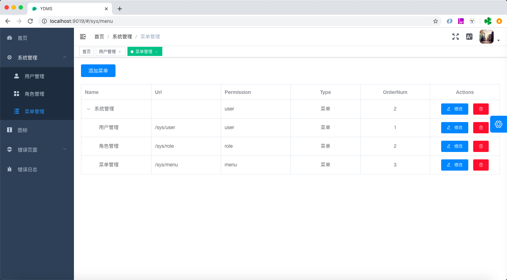

## 简介 

YDMS是一个简单的后台管理系统。目标是为各位赶项目的朋友提供一个基础框架，欢迎各位开发者基于本项目做业务的开发。本项目采用vue+java前后端分离，但打包时又可以把前端的页面打包到jar包里，节约资源。

## 在线 DEMO
[http://121.36.196.89:9019/](http://121.36.196.89:9019/)

## 快速开始
安装前，请确保你的电脑安装了jdk1.8或以上版本, MySQL 5.6或以上版本
- STEP 1: 初始化数据库
在Mysql里新建一个数据库，数据库名：ydms.
导入SQL，生成系统需要的表。SQL在docs目录下，ydms_init.sql
- STEP 2：编译
window下你可以运行以下命令编译：
```
mvnw package
```
mac下你可以运行以下命令编译：
```
./mvnw package
```
当然，我们也可以在Idea里导入项目，然后用Idea来编译。
- STEP 3：运行
编译成功，就可以直接运行了
```
java -jar ydms-service/target/ydms-service-0.1.0.jar
```

- STEP 4：查看界面
运行起来后，就可以通过浏览器查看了。默认端口是9019.
你可以在浏览器的地址栏里输入 http://localhost:9019 来访问YDMS系统

## 界面初看


